# Ignatius at Home

> ## 📐 How it all works: [ARCHITECTURE.md](https://github.com/bcollier/ignatius-hw4-api/blob/main/docs/ARCHITECTURE.md)
>
> The full technical documentation lives in the API repo, with 26 diagrams: the system and hosting on GitHub Pages, Render and Supabase, the database ERD, sign-in and guest flows, how a retreat is made step by step, the research services, the prayer player, Talk it over, example retreats, the research page, status lifecycles, every API endpoint with examples, costs, security and failure handling.
>
> **Live app:** https://bcollier.github.io/ignatius-hw4-web/ · **Backend repo:** [ignatius-hw4-api](https://github.com/bcollier/ignatius-hw4-api) · **Every prompt used to build it:** [PROMPT_LOG.md](PROMPT_LOG.md) · **Original design spec and build plan:** [design spec](https://github.com/bcollier/ignatius-hw4-api/blob/main/docs/original-spec/design-spec.md), [technical spec](https://github.com/bcollier/ignatius-hw4-api/blob/main/docs/original-spec/technical-spec.md), [build plan](https://github.com/bcollier/ignatius-hw4-api/blob/main/docs/original-spec/staging-plan.md) · **Redesign spec:** [IMPROVEMENTS.md](https://github.com/bcollier/ignatius-hw4-api/blob/main/docs/IMPROVEMENTS.md) · **Visual redesign spec:** [VISUAL_REDESIGN.md](https://github.com/bcollier/ignatius-hw4-api/blob/main/docs/VISUAL_REDESIGN.md) · **Code review guidance:** [CODE_REVIEW.md](https://github.com/bcollier/ignatius-hw4-api/blob/main/docs/CODE_REVIEW.md)

**Ignatius at Home turns prayer material you already have into a guided audio retreat you can pray at home, one day at a time.** Upload a retreat handout, a few passages of scripture, a reading with a painting, anything you have the right to use, and press **Make my retreat**. Twenty minutes later there is a week of prayer waiting: for each day the passage read aloud, a reflection for the heart, a deep dive into the passage's history and theology, and a gentle spoken guide who asks for the day's grace and leads you through the passage four times in the old pattern of *lectio divina*, with silence and a bell. On a phone, the day's painting fills the screen while you pray.

<p align="center">
  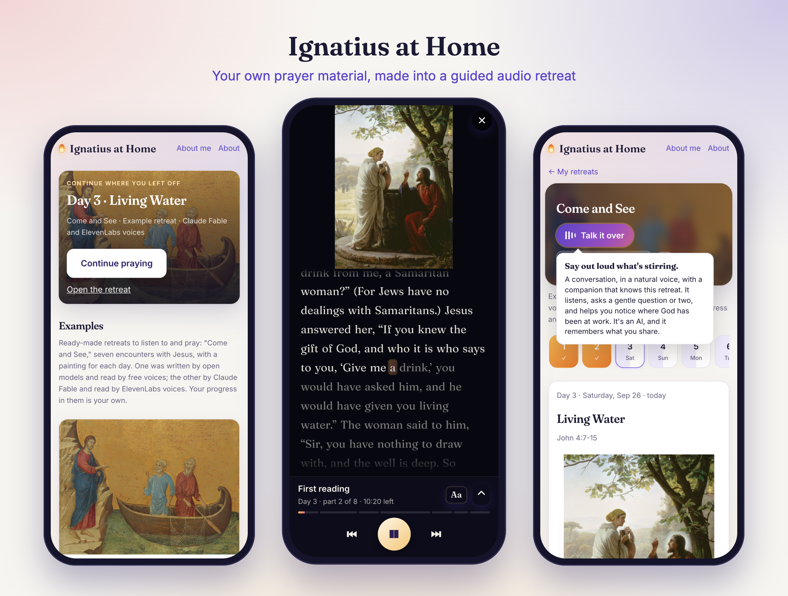
</p>

This repository is the **frontend**: plain HTML, CSS and JavaScript, no framework and no build step, served by GitHub Pages and installable on a phone's home screen. The backend is [ignatius-hw4-api](https://github.com/bcollier/ignatius-hw4-api), a FastAPI service on Render.

---

## Contents

1. [Why this exists](#1-why-this-exists)
2. [A primer: Ignatian spirituality, retreats and lectio divina](#2-a-primer-ignatian-spirituality-retreats-and-lectio-divina)
3. [How a day is prayed in the app](#3-how-a-day-is-prayed-in-the-app)
4. [Screenshots](#4-screenshots)
5. [The example retreats: "Come and See"](#5-the-example-retreats-come-and-see)
6. [Every view](#6-every-view)
7. [Voices: hear them and compare](#7-voices-hear-them-and-compare)
8. [Talk it over: the live conversation](#8-talk-it-over-the-live-conversation)
9. [Research services](#9-research-services)
10. [The models](#10-the-models)
11. [The research page](#11-the-research-page)
12. [Design choices](#12-design-choices)
13. [Phones: the prayer screen](#13-phones-the-prayer-screen)
14. [Accessibility](#14-accessibility)
15. [Privacy, rights and copyright](#15-privacy-rights-and-copyright)
16. [Frontend architecture](#16-frontend-architecture)
17. [How it talks to the backend](#17-how-it-talks-to-the-backend)
18. [Run it locally](#18-run-it-locally)
19. [Deploying on GitHub Pages](#19-deploying-on-github-pages)
20. [How it was built: a journal](#20-how-it-was-built-a-journal)
21. [Lessons learned and bugs fixed](#21-lessons-learned-and-bugs-fixed)
22. [Services: what runs it, free and paid](#22-services-what-runs-it-free-and-paid)
23. [Resources, credits and links](#23-resources-credits-and-links)

---

## 1. Why this exists

This started as a submission for **Homework 4 of CMU's 15-113**, which asks for server-side code deployed on [Render](https://render.com) with a web front end. The assignment could have been anything; I chose a problem from my own prayer life.

Every week I pray with a parish **retreat in daily life**: a months-long walk through the *Spiritual Exercises* of Saint Ignatius, with a printed handout for each week holding the scripture passages, a grace to ask for, notes and a painting or two. The handout is good, but praying from paper at 6 a.m. is hard, and the texts deserve more than a quick read. What I wanted was someone to *read* the passage to me, slowly, several times; to offer a short reflection that meets me where I am; to tell me what the scholars know about the passage; and then to leave me in silence. So the app does that, from whatever material I give it.

It was designed from the start so that **the user supplies the content**. My parish handouts are not mine to publish, and many Bible translations are under copyright, so the app never ships any of that. Each person uploads material they own or have permission to use, and their retreats are private to their account. For the public demo I made a new retreat package entirely from public-domain sources (section 5).

Three more ideas shaped the project:

- **Anyone can use it for free.** Premium models and voices cost money, so free accounts use open models on [Jetstream2](https://jetstream-cloud.org) (an NSF academic cloud I have access to), free Microsoft voices, and free tiers of six web research services. Premium (Claude and ElevenLabs) is for a short allowlist of accounts, and everyone can *hear* the difference in the premium example retreat.
- **One button.** Upload, press **Make my retreat**, walk away. Everything adjustable lives under **Advanced**, and nothing there is required.
- **It should feel like prayer, not software.** On the phone, where people actually pray, there are no costs, no settings, no menus: the painting, the voice and a small player.

---

## 2. A primer: Ignatian spirituality, retreats and lectio divina

The app is built around a tradition that is almost five hundred years old. If you've never met it, here is what you need to understand what the app is doing and why. (The same background, condensed, is sent to every AI model the app uses, so that the models know it too.)

### Ignatius of Loyola

Íñigo López de Loyola was born in 1491 in the Basque country of northern Spain, the youngest son of a noble family, and grew up a courtier and soldier with dreams of chivalry and romance. In 1521, defending the fortress of Pamplona against the French, his leg was shattered by a cannonball. During a long convalescence at Loyola the only books in the house were a life of Christ (Ludolph of Saxony's *Vita Christi*) and a collection of saints' lives. He found himself daydreaming alternately about knightly exploits and about imitating the saints, and he noticed something that would shape all of Ignatian spirituality: the knightly daydreams delighted him while they lasted but left him dry and restless afterward, while the dreams of following Christ left him quietly consoled long after. **Paying attention to the aftertaste of our inner movements** became the root of what he later called the discernment of spirits.

After his recovery he went to the Benedictine monastery of **Montserrat**, laid his sword before the statue of Our Lady, and spent almost a year at **Manresa** in intense prayer, penance, darkness and finally great illumination, keeping notes on what helped. Those notes became the *Spiritual Exercises*. He went on pilgrimage to Jerusalem, came back to study (Barcelona, Alcalá, Salamanca, where the Inquisition questioned him more than once about giving the Exercises as a layman, and finally Paris), and gathered companions, among them Peter Faber and Francis Xavier, by giving them the Exercises. In 1534 the group made vows together at Montmartre; in 1540 Pope Paul III approved them as the **Society of Jesus**, the Jesuits. Ignatius led the Society from Rome until his death in 1556, and was canonized in 1622.

### The Spiritual Exercises

The *Spiritual Exercises* is not a book to be read straight through. It is a **manual for the person guiding someone else** through a path of prayer: a collection of meditations, contemplations, instructions, rules and notes, which Pope Paul III approved in 1548. "Just as walking and running are bodily exercises," Ignatius writes at the start, these are ways of "preparing and disposing the soul" to rid itself of disordered attachments and to seek and find God's will in one's life.

The Exercises are arranged in **four "weeks,"** which are stages rather than calendar weeks:

| Week | Focus | The grace asked for, roughly |
| --- | --- | --- |
| (Before) | The **Principle and Foundation**: we are created to praise, reverence and serve God, and everything else is a means to that end | Freedom ("indifference") toward everything that isn't God |
| First | Sin, one's own and the world's, seen in the light of God's mercy | To know myself as a loved sinner, sorrow, and gratitude |
| Second | The life of Christ, from the Incarnation through his public ministry, with the Call of the King, the Two Standards and the choice of a way of life | "To know him more intimately, love him more, and follow him more closely" |
| Third | The Passion | To be with Christ in his suffering |
| Fourth | The Resurrection, ending with the **Contemplation to Attain Love** | To rejoice with the risen Christ, and to find God in all things |

**The annotations.** The Exercises open with twenty notes on how to give them. Three matter most for an app like this:

- **Annotation 20** describes the full Exercises made in about thirty days of silence, away from ordinary life, which is what most people picture as "the Ignatian retreat."
- **Annotation 19** allows someone "involved in public affairs or necessary business" to make the Exercises **in daily life**, taking an hour and a half a day over a much longer time. This is the "retreat in daily life" or "19th Annotation retreat" many parishes and Jesuit ministries offer over several months, and it's the rhythm Ignatius at Home was built for: one day's prayer at a time, week after week, as a series.
- **Annotation 18** adapts the Exercises to a person's capacity and desire, offering lighter forms.
- And **Annotation 15**, often quoted: the one giving the Exercises should not lean toward one choice or another but "allow the Creator to deal directly with the creature." That is the right posture for an AI companion too, and the app's conversation companion is instructed accordingly.

**How a time of prayer is shaped.** Ignatius gives each prayer period a form: a preparatory prayer; the **preludes**, which include imagining the place ("composition of place") and **asking for what I want**, the grace of the day, as something one truly desires; the points to pray with; and a **colloquy** at the end, speaking to God "as one friend speaks to another." Prayer periods are often followed by **repetitions**, returning to the places where one felt most moved. The app's spoken guide follows this shape: it opens by asking for the day's grace, gives time to want it, and closes by inviting a colloquy.

**Ignatian contemplation.** For the Gospel scenes of the second through fourth weeks, Ignatius asks the person to enter the scene with the imagination: to see the people, hear what they say, notice what they do, even take a part in the scene. This is why the app shows paintings: a great painting of the scene (Caravaggio's tax collector looking up from his coins, Rembrandt's father embracing his son) is an old and powerful way into imaginative prayer.

**Consolation, desolation and discernment.** Ignatius's **rules for the discernment of spirits** teach a person to notice the movements of the heart. *Consolation* is any movement that draws one toward God, faith, hope and love, often felt as peace or joy; *desolation* is the opposite, darkness, turmoil, pulling away. The rules teach, for example, never to make a change in a time of desolation. The app's reflections and its spoken guidance invite the listener to notice what stirs, "consolation or desolation," because that noticing is the heart of the Ignatian way.

**The Examen.** Ignatius asked his companions never to skip the daily **Examen**: a short prayer, usually at the end of the day, of giving thanks, asking for light, reviewing the day for where God was present and where one turned away, asking forgiveness, and looking to tomorrow. The app's guidance before each reading ("On this first reading, simply listen...") borrows the Examen's gentle, step-by-step way of directing attention.

**Spiritual direction, and why this app is not it.** A person making the Exercises meets regularly with a **spiritual director**, someone trained to listen, who helps them notice what is happening in their prayer. Good directors mostly ask questions, rarely give advice, and trust that God is already at work. The app's **Talk it over** feature is *modeled on* that kind of listening, but it is not spiritual direction and never calls itself that. It says plainly that it is an AI, points to a human director where one would help, and in a crisis stops and gives the 988 lifeline. An app can keep you company on the way; it cannot accompany you the way a person can.

### What a retreat is

A **retreat** is time set apart from ordinary life for prayer. It can be a weekend at a retreat house, the full thirty days in silence, a guided retreat with daily meetings with a director, or, since Annotation 19, a retreat made at home in daily life. Many parishes, universities and Jesuit ministries run such retreats through the year, with a handout of scripture and readings for each week. A retreat in this app is a set of days (usually seven), each with a passage, a grace, images, and the recorded prayer. Retreats can be linked into a **series**, so a nine-month retreat can be made week by week, each week's writing aware of the weeks that came before.

### Lectio divina

**Lectio divina**, "divine reading," is the ancient monastic practice of praying slowly with scripture, reading not for information but to be addressed. Saint Benedict's Rule (sixth century) sets aside hours for it each day. In the twelfth century the Carthusian prior **Guigo II** described its stages in a short letter known as *The Ladder of Monks* (*Scala Claustralium*):

1. **Lectio** (reading): reading the text attentively.
2. **Meditatio** (meditation): pondering what it says, and what it says to me.
3. **Oratio** (prayer): responding to God from the heart.
4. **Contemplatio** (contemplation): resting in God, beyond words.

"Reading seeks, meditation finds, prayer asks, contemplation tastes," Guigo wrote. In 2010 Pope Benedict XVI's apostolic exhortation ***Verbum Domini*** (paragraphs 86–87) described the same steps and added a fifth, **actio**, carrying the word into one's life.

The app prays each day as a lectio divina: the passage is **heard four times**, each time with a different focus, and the reflection and deep dive are woven between the readings like the meditation of a monk turning the text over. There is a long silence between two bells for contemplation, and the colloquy at the end for prayer in one's own words.

Further reading is in section 22 and on the app's [About page](https://bcollier.github.io/ignatius-hw4-web/?about).

---

## 3. How a day is prayed in the app

A day has four recorded parts, each in a voice the user can choose:

| Part | What it is | Who writes it |
| --- | --- | --- |
| **The reading** | The day's passage, word for word from the uploaded document | Your document (never rewritten) |
| **For the heart** | A short reflection addressed to the listener: a companion's voice, or, if chosen, the voice of Jesus in the manner of Ignatian imaginative prayer | The model |
| **Deep dive** | The passage's setting, original-language words where well documented, how the church has read it, real interpretive questions; researched on the web, with sources | The model, with web research |
| **Spoken guidance** | Short lines before each reading and the silence, asking for the grace, and a closing | Defaults below, tailored by the model to that day's reflection and deep dive |

The parts are written **in the order they are heard** and each knows what came before: the deep dive sees the reflection and builds on it rather than repeating it, and the guidance is then tailored to both (the line before the second reading might point back to the image the reflection invited you to stay with). The default guidance, which the user can edit under Advanced:

> **Opening:** "Day {day}. {title}. Settle yourself, and become aware that God is present with you now. {grace} Stay with that desire for a few moments."
>
> **Before the first reading:** "We will hear today's reading four times. On this first reading, simply listen. Notice any word or phrase that catches your attention."
>
> **Before the second:** "Now the reading a second time. Listen for how these words touch your own life. Notice what stirs in you: a memory, a desire, consolation or desolation."
>
> **Before the third:** "The third reading. Listen for what God may be offering you, or asking of you, in these words."
>
> **Before the silence:** "Now rest in silence with the word or phrase that stayed with you. Let it pray in you. A bell will mark the end of the silence."
>
> **Before the last reading:** "The last reading. Let the words rest in you, then speak to God in your own words, as one friend speaks to another."
>
> **Closing:** "Thank God for this time of prayer, and close with the Our Father. Amen."

**The lectio order**, as played:

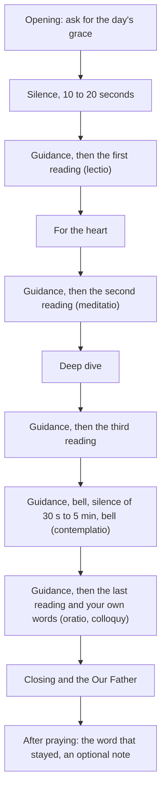

There are five-second gaps between parts so nothing runs together. A **Simple** order (reading, reflection, deep dive, silence) is offered too. A typical day lasts 20 to 30 minutes; the app shows the length before you start. When the last clip ends the day is marked prayed, and the app asks for the word or phrase that stayed with you and an optional note, a tiny journal that the conversation companion can later ask about.

---

## 4. Screenshots

All screenshots are of the example retreat "Come and See," taken at iPhone size (390 × 844 points, 3× pixels) and on a laptop.

### On an iPhone

<table>
  <tr>
    <td align="center" width="33%">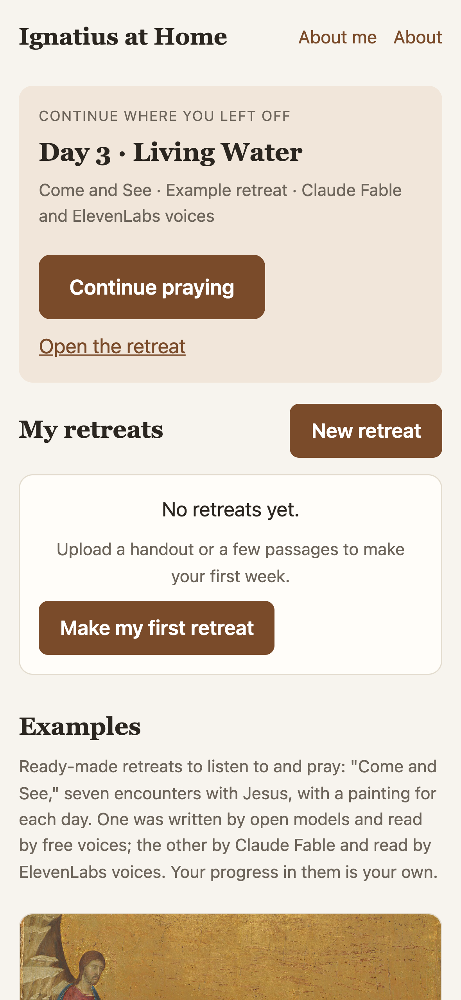<br><sub><b>Library.</b> The Continue card picks up where you stopped; examples show their first painting.</sub></td>
    <td align="center" width="33%">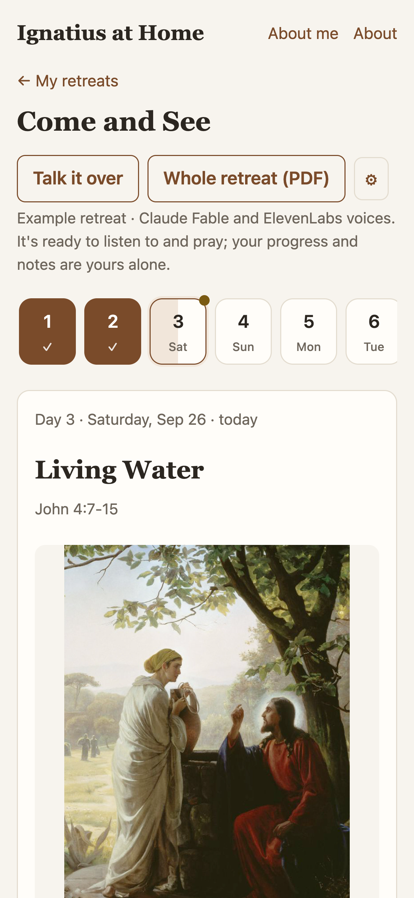<br><sub><b>A day.</b> The strip shows prayed, started, missed and today; the grace and passage in full.</sub></td>
    <td align="center" width="33%">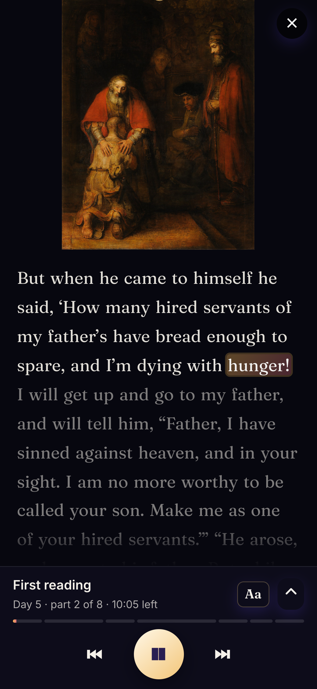<br><sub><b>Praying.</b> The painting fills the screen; a small player is docked at the bottom.</sub></td>
  </tr>
  <tr>
    <td align="center">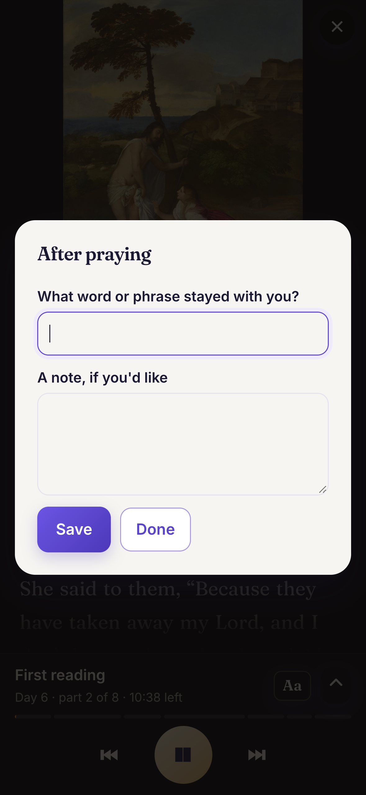<br><sub><b>After praying.</b> The word or phrase that stayed, and a note.</sub></td>
    <td align="center">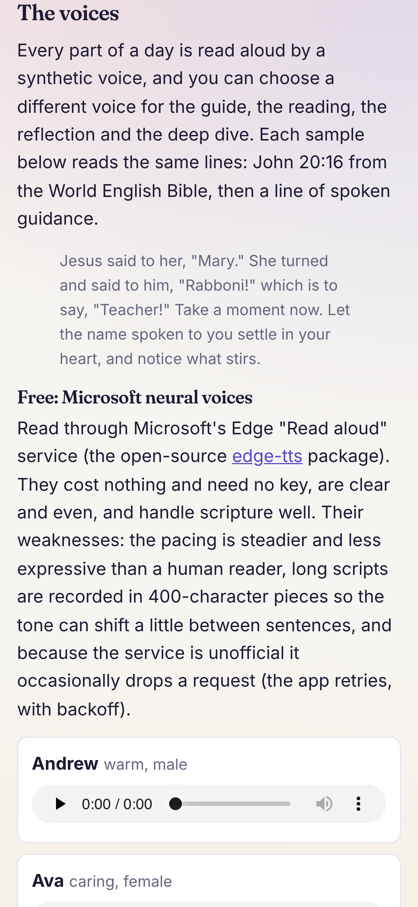<br><sub><b>About.</b> The Exercises, retreats, lectio divina, voice samples and research services.</sub></td>
    <td align="center">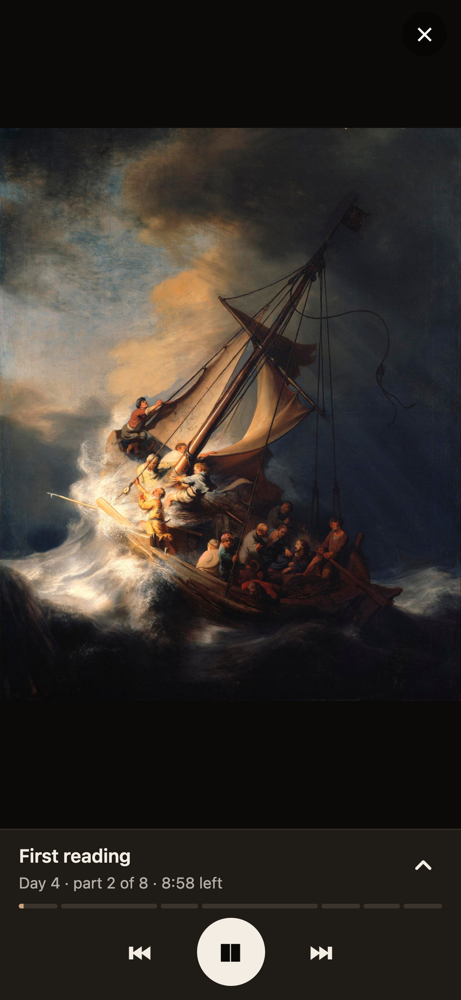<br><sub><b>Dark mode.</b> Day 4, the storm on the lake.</sub></td>
  </tr>
  <tr>
    <td align="center">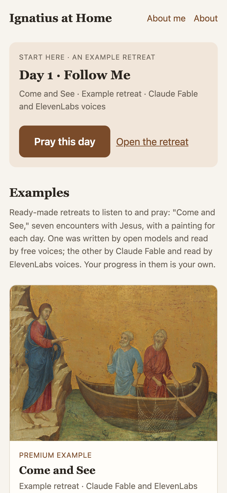<br><sub><b>First sign-in.</b> With nothing of your own yet, the examples come first.</sub></td>
    <td align="center">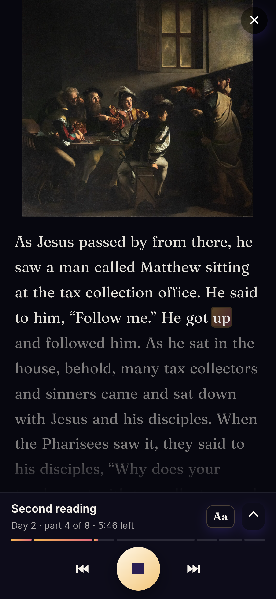<br><sub><b>Day 2.</b> Caravaggio's <i>Calling of Saint Matthew</i>.</sub></td>
    <td align="center">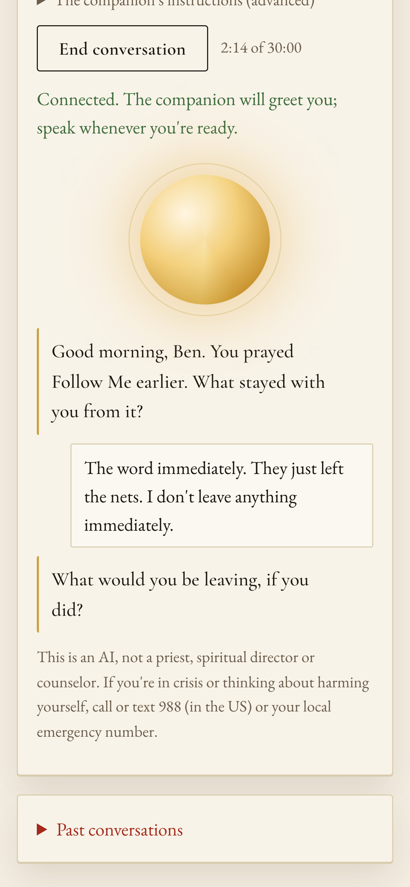<br><sub><b>Talk it over.</b> A live spoken conversation; the orb glows as the companion speaks (sample exchange).</sub></td>
  </tr>
</table>

### On a computer

<table>
  <tr>
    <td align="center" width="50%"><br><sub><b>New retreat.</b> Drop a file, press Make my retreat.</sub></td>
    <td align="center" width="50%">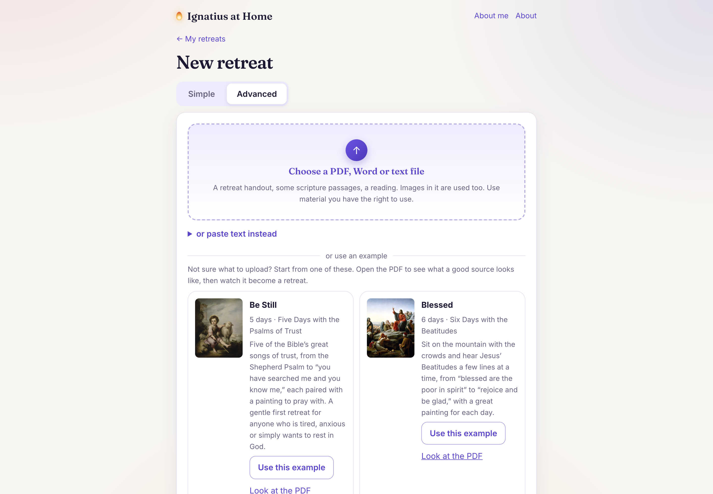<br><sub><b>Advanced.</b> Models, research, a voice for each part, the prayer's order and silences, every prompt and line of guidance.</sub></td>
  </tr>
  <tr>
    <td align="center">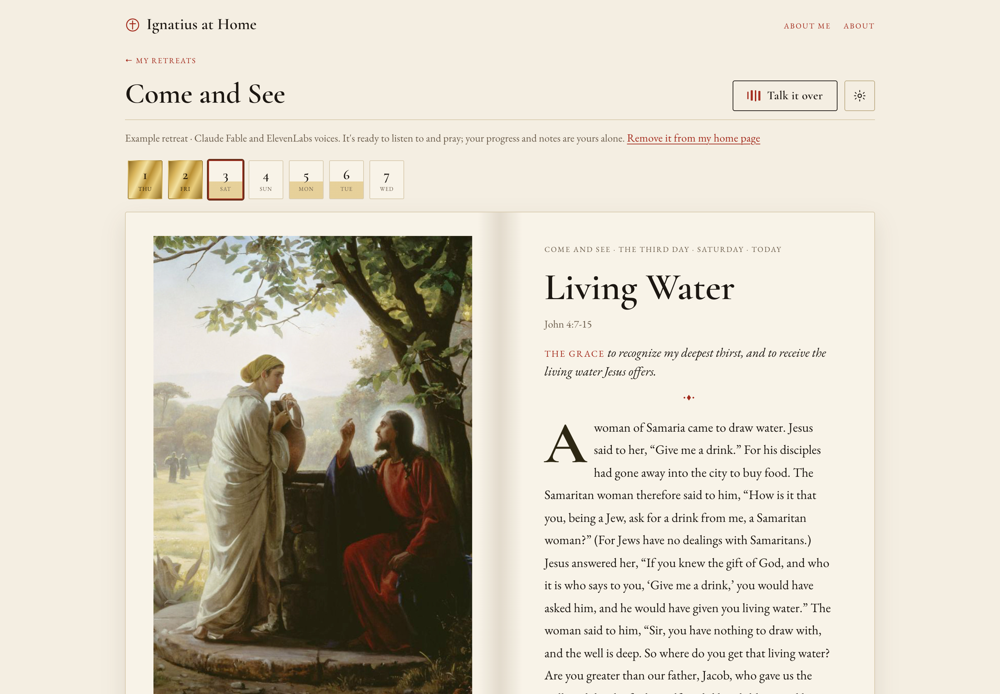<br><sub><b>A retreat.</b> Day strip, the day's painting, passage and parts.</sub></td>
    <td align="center">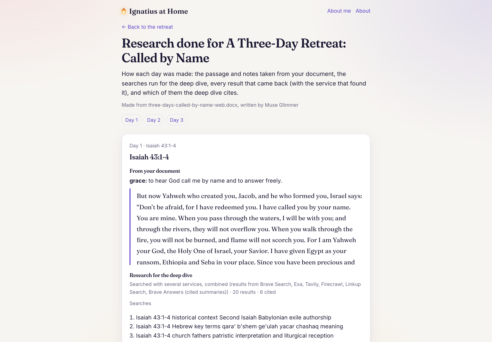<br><sub><b>Research.</b> Every search and result behind each day's deep dive.</sub></td>
  </tr>
  <tr>
    <td align="center">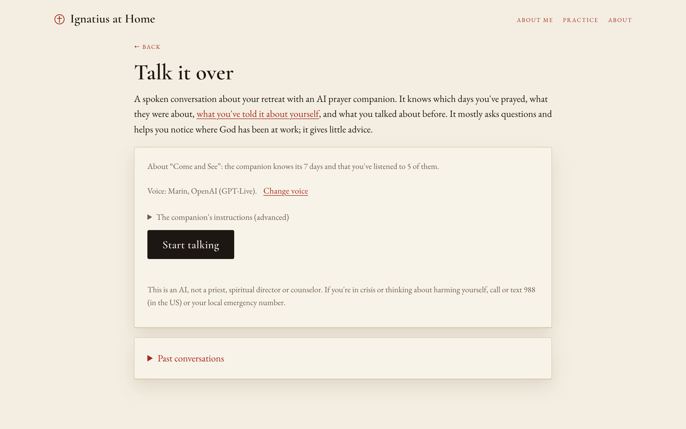<br><sub><b>Talk it over.</b> What the companion knows, the voice, and Start talking.</sub></td>
    <td></td>
  </tr>
</table>

---

## 5. The example retreats: "Come and See"

At first sign-in everyone, including guests, finds two ready-made retreats under **Examples** in the library. They are the same seven days made two ways, so anyone can hear what the free and premium versions sound like without spending anything:

| | Free example | Premium example |
| --- | --- | --- |
| Writing | Muse Glimmer on Jetstream2 | **Claude Fable 5.1** through OpenRouter |
| Deep-dive research | All six research services combined | Claude's own web search |
| Voices | Microsoft: Ava (guide), Andrew (reading and reflection), Christopher (deep dive) | ElevenLabs: Sarah (guide), George (reading), Brian (reflection), Alice (deep dive) |

The examples are **listen only**: you can pray them, mark days prayed, write the word that stayed, change the start date, print the script, read the research and talk them over, but not rewrite, re-record, rename or delete them. Your progress in an example is yours alone; nobody else sees it.

**The package.** *Come and See: Seven Encounters with Jesus* was made for this project (source and script in the API repo's [`samples/demo/`](https://github.com/bcollier/ignatius-hw4-api/tree/main/samples/demo)). Each day is a moment when someone meets Jesus in the Gospels, with a grace to ask for and a public-domain painting:

| Day | Title | Passage (World English Bible) | Grace | Painting |
| --- | --- | --- | --- | --- |
| 1 | Follow Me | Mark 1:16-20 | To hear Jesus call me where I am, and to leave behind whatever keeps me from following him | Duccio, *The Calling of the Apostles Peter and Andrew*, 1308–11 (National Gallery of Art) |
| 2 | He Rose and Followed | Matthew 9:9-13 | To know that Jesus calls me as I am, with all my history, and to rise and follow him | Caravaggio, *The Calling of Saint Matthew*, 1599–1600 (San Luigi dei Francesi) |
| 3 | Living Water | John 4:7-15 | To recognize my deepest thirst, and to receive the living water Jesus offers | Carl Bloch, *Woman at the Well* |
| 4 | Why Are You Afraid? | Mark 4:35-41 | To trust Jesus in the storms of my life, even when he seems to be asleep | Rembrandt, *Christ in the Storm on the Sea of Galilee*, 1633 |
| 5 | Welcomed Home | Luke 15:17-24 | To come home, and to let the Father embrace me before I finish my apology | Rembrandt, *The Return of the Prodigal Son*, about 1668 (Hermitage) |
| 6 | Called by Name | John 20:11-18 | To hear the risen Jesus call me by name, and to go and tell what I have seen | Titian, *Noli me Tangere*, about 1514 (National Gallery, London) |
| 7 | Our Hearts Burning | Luke 24:28-35 | To recognize Jesus in the breaking of the bread, and to feel my heart burn within me | Caravaggio, *Supper at Emmaus*, 1601 (National Gallery, London) |

The paintings were chosen for drama and for how well they invite imaginative prayer: Caravaggio's shaft of light falling on Matthew at his table, Rembrandt's disciples fighting the sail as Jesus sleeps, the father's two different hands on the prodigal's back. They are fetched at 1920 pixels wide from Wikimedia Commons, all public domain or CC0. The PDF has a typographic cover so each painting appears only on its own day, which lets the planner give every day exactly one image. The retreat opens with a page on how to pray the week, written for the package.

---

## 6. Every view

| URL | View | What's on it |
| --- | --- | --- |
| `./` | **Library** | A **Continue** card that picks the right day: one you started and stopped, then one you missed, then today's, then the first unprayed ("Start here · an example retreat" until you have your own). Your retreats grouped by series, each with a row of day chips. **Examples** as cards with their first painting. A guest banner offering to add an email so a guest's retreats move to their phone. |
| `./?new` | **New retreat** | **Simple:** drop a PDF, Word or text file, paste text, or use an example document ("Be Still", "Blessed"; open its PDF first to see what a good source looks like), optionally mark it as part of a series and pick the earlier weeks, confirm you have rights, **Make my retreat**. **Advanced:** models for planning and writing, web research (All services combined, or one), a voice for the guide, reading, reflection and deep dive (free and premium mixed freely), the prayer order and silences, the start date, tailoring the guidance on or off, the conversation voice service and voice, every prompt (planning, reflection with two presets, deep dive) and every line of spoken guidance, "Reset every option," and the Research page switch. |
| `./?costs` | **Costs** | Debug mode only (a small "Costs" link in the footer). Each retreat by part and by company, a grand total by company, what isn't tied to a retreat, the prices used, and an estimate for a new retreat. Nothing about cost appears anywhere else in the app. |
| `./?r=ID` → **Build log** | **Build log** | Debug mode only. A terminal-style window with every step and every call to a model, search service and voice as the retreat is made, live ("Watch the technical details as it's made" on New retreat), or afterwards from "Build log" at the foot of a retreat. Download the full log as JSON. |
| `./?r=ID` | **A retreat** | While it's being made: a progress panel listing each day (writing, recording, done, failed) and "Tell me when it's ready." Then: the day strip (prayed, started, missed, today), the day's date, title, painting, grace and passage, **Pray this day** (or **Continue praying** / **Start over**), its length, Mark as prayed, Printable script, Listen to a part (each part with its script and sources), and a More menu (Re-record with other voices, Rewrite, Edit what I noted, Research for this day). Header: Talk it over, Whole retreat PDF, Research (desktop, if switched on), and a gear for prayer settings. Costs only while it's being made, and never on a phone. |
| `./?r=ID&pray=N` | **Praying** | Full screen: the day's paintings cross-fading, the title and grace, the current part, and a player docked at the bottom (play/pause, back and skip by part, a progress line). After the last part: "After praying." |
| `./?r=ID&research` | **Research** | Desktop only. For each day: the passage and notes from the document, the searches, every result with its service, which were cited. See section 11. |
| `./?talk&r=ID` | **Talk it over** | Start/end, a timer, a live transcript, past conversations with **Forget all our conversations**, and a plain statement that this is an AI, with the 988 lifeline. |
| `./?me` | **About me** | Type or upload (text, Markdown, Word, PDF) what you'd like the app to know about you; a note if a long file was condensed; what you want from the conversation companion. |
| `./?about` | **About** | The Spiritual Exercises, retreats, lectio divina, how a day is prayed, [every voice with a sample to play](https://bcollier.github.io/ignatius-hw4-web/?about#voices), [each research service](https://bcollier.github.io/ignatius-hw4-web/?about#research), links. Readable without signing in. |

Views are plain `<section>`s in `index.html`; the router shows one at a time based on the query string, so every view has a real, shareable, back-button-friendly URL.

---

## 7. Voices: hear them and compare

Every part of a day is read by a synthetic voice, and each part can have its own. GitHub can't play audio inside a README, so each sample below is a link that plays in your browser. Better still, the app's **[About page](https://bcollier.github.io/ignatius-hw4-web/?about#voices)** has all twelve side by side with players. Every sample reads the same words: John 20:16 from the World English Bible, then a line of guidance:

> Jesus said to her, "Mary." She turned and said to him, "Rabboni!" which is to say, "Teacher!" Take a moment now. Let the name spoken to you settle in your heart, and notice what stirs.

### Free: Microsoft neural voices

| Voice | Character | Listen |
| --- | --- | --- |
| Andrew | warm, male | [▶ Listen](https://bcollier.github.io/ignatius-hw4-web/samples/voices/free-andrew.mp3) |
| Ava | caring, female | [▶ Listen](https://bcollier.github.io/ignatius-hw4-web/samples/voices/free-ava.mp3) |
| Brian | easygoing, male | [▶ Listen](https://bcollier.github.io/ignatius-hw4-web/samples/voices/free-brian.mp3) |
| Emma | clear, female | [▶ Listen](https://bcollier.github.io/ignatius-hw4-web/samples/voices/free-emma.mp3) |
| Christopher | steady, male | [▶ Listen](https://bcollier.github.io/ignatius-hw4-web/samples/voices/free-christopher.mp3) |
| Aria | confident, female | [▶ Listen](https://bcollier.github.io/ignatius-hw4-web/samples/voices/free-aria.mp3) |

These are Microsoft's neural voices, reached through the Edge browser's "Read aloud" service with the open-source [edge-tts](https://github.com/rany2/edge-tts) package. **Strengths:** they cost nothing, need no account or key, are clear and even, pronounce scripture names well, and are fast (the server records six pieces at once). **Weaknesses:** the pacing is steadier and less expressive than a human reader; long scripts have to be recorded in pieces of about 400 characters, so the tone can shift slightly between sentences; and because the service is unofficial it sometimes drops a connection, so the server retries each piece up to four times with growing waits (a real test build lost two clips before that was added).

### Premium: ElevenLabs

| Voice | Character | Listen |
| --- | --- | --- |
| Brian | deep, comforting, male | [▶ Listen](https://bcollier.github.io/ignatius-hw4-web/samples/voices/premium-brian.mp3) |
| George | warm storyteller, British male | [▶ Listen](https://bcollier.github.io/ignatius-hw4-web/samples/voices/premium-george.mp3) |
| Bill | wise, mature, male | [▶ Listen](https://bcollier.github.io/ignatius-hw4-web/samples/voices/premium-bill.mp3) |
| Sarah | reassuring, female | [▶ Listen](https://bcollier.github.io/ignatius-hw4-web/samples/voices/premium-sarah.mp3) |
| Alice | clear educator, British female | [▶ Listen](https://bcollier.github.io/ignatius-hw4-web/samples/voices/premium-alice.mp3) |
| Lily | velvety, British female | [▶ Listen](https://bcollier.github.io/ignatius-hw4-web/samples/voices/premium-lily.mp3) |

**Why someone would choose the premium voices.** Listen to the two Brians back to back. [ElevenLabs](https://elevenlabs.io) voices *perform* the text: they breathe, slow down before something important, lower their voice for "Mary," and let a pause sit. For most apps that's a nicety. For prayer it matters a great deal, because the whole point is to listen for twenty minutes in the dark and be drawn in rather than informed. A reflection read by a voice that sounds like it means it lands differently. ElevenLabs also holds one voice consistently across long passages: the app records in pieces of about 2,500 characters and sends each piece with the text before it (`previous_text`), so the joins are seamless. One lesson from building the premium example: ElevenLabs plans limit how many requests can run at once (three on the Starter plan), and a day's many short guidance clips all started together and were refused. The server now sends at most two at a time and retries a refusal, and **Try again** on a day re-records only the clips that failed, from the saved scripts. The costs: about 10,000 to 15,000 characters for a whole day, charged against the account's monthly credits, so premium voices are limited to allowlisted accounts. The premium example retreat lets everyone hear them.

**Mixing.** Voices can be mixed freely: a premium voice for the reflection, where warmth matters most, and free voices for the rest keeps costs down.

---

## 8. Talk it over: the live conversation

A spoken conversation, in real time, about the retreat. The companion knows the retreat's days, which ones you've prayed, listened to or missed, what you noted after praying, what you've told the app about yourself, your past conversations (the recent ones in full, older ones as a summary), how long it has been since you last talked, and the time of day where you are, so it can say "It's late; how was today's prayer?" and mean it. It mostly asks questions, gently probes, helps you notice where God may be at work, and gives very little advice, following how spiritual directors are taught to listen. It is not spiritual direction and says so.

<table>
  <tr>
    <td align="center" width="50%"><br><sub><b>Before.</b> What it knows about the retreat (here, that five of seven days were listened to), the voice, the companion's instructions under Advanced, and Start talking.</sub></td>
    <td align="center" width="50%"><br><sub><b>During.</b> The orb glows and swells with the companion's voice (and with yours while it listens); the transcript builds below. The exchange shown is a sample.</sub></td>
  </tr>
</table>

| Provider | How it connects | Voices | Cost |
| --- | --- | --- | --- |
| **OpenAI GPT-Live** (`gpt-live-1`) | The browser makes a WebRTC offer; the server relays it to OpenAI with the key and returns the answer, then audio flows directly between the browser and OpenAI. The server hangs up at the time limit. | Marin, Cedar, Vesper, Willow, Quartz, Meridian and more | about 5¢ a minute |
| **xAI Grok voice** | The server mints a short-lived token; the browser opens a WebSocket, streams the microphone as 24 kHz PCM16 through an AudioWorklet and plays the replies. | Eve, Ara, Rex, Sal, Leo (refreshed from xAI's list) | about 8¢ a minute |

**Why these two.** Both are true speech-to-speech models with natural turn-taking and very low delay, which a "transcribe, think, speak" chain can't match. OpenRouter, which the app uses for text models, can't carry live audio, so these use their own keys, which never leave the server. OpenAI's WebRTC path is the smoothest; Grok's voices are more distinctive and its WebSocket path works where WebRTC is blocked.

**Limits.** Free accounts get **60 seconds a day**, enough to try it; premium accounts up to 30 minutes a call. Transcripts are saved to the person's private storage so the companion remembers, and can be erased with one button.


### What the conversation voices sound like

Every voice below says the same line: *"Hello. I'm glad you're here. What stayed with you from today's prayer?"* The samples were recorded with each company's text-to-speech, so they're close to, but a little more formal than, the same voice in a live conversation. xAI's API lists each voice's gender, but gives no other description; listening is the honest way to choose. OpenAI's other ten live voices (Vesper, Willow, Quartz, Meridian, Stone, Gleam, Beacon, Delta, Cinder, Ripple) exist only in live conversation, so they have no sample; start a conversation to hear them. In the app, the **Talk it over** page has a **Change voice** link with "▶ Hear this voice" button next to the voice picker, and the [About page](https://bcollier.github.io/ignatius-hw4-web/?about#talk-voices) has a player for each.

| Voice | Service | Gender | Sample |
| --- | --- | --- | --- |
| Marin | OpenAI | — | [▶ Listen](https://bcollier.github.io/ignatius-hw4-web/samples/talk/openai-marin.mp3) |
| Cedar | OpenAI | — | [▶ Listen](https://bcollier.github.io/ignatius-hw4-web/samples/talk/openai-cedar.mp3) |
| Altair | xAI Grok | male | [▶ Listen](https://bcollier.github.io/ignatius-hw4-web/samples/talk/xai-altair.mp3) |
| Ara | xAI Grok | female | [▶ Listen](https://bcollier.github.io/ignatius-hw4-web/samples/talk/xai-ara.mp3) |
| Atlas | xAI Grok | male | [▶ Listen](https://bcollier.github.io/ignatius-hw4-web/samples/talk/xai-atlas.mp3) |
| Aurora | xAI Grok | female | [▶ Listen](https://bcollier.github.io/ignatius-hw4-web/samples/talk/xai-aurora.mp3) |
| Carina | xAI Grok | female | [▶ Listen](https://bcollier.github.io/ignatius-hw4-web/samples/talk/xai-carina.mp3) |
| Castor | xAI Grok | male | [▶ Listen](https://bcollier.github.io/ignatius-hw4-web/samples/talk/xai-castor.mp3) |
| Celeste | xAI Grok | female | [▶ Listen](https://bcollier.github.io/ignatius-hw4-web/samples/talk/xai-celeste.mp3) |
| Cosmo | xAI Grok | male | [▶ Listen](https://bcollier.github.io/ignatius-hw4-web/samples/talk/xai-cosmo.mp3) |
| Eve | xAI Grok | female | [▶ Listen](https://bcollier.github.io/ignatius-hw4-web/samples/talk/xai-eve.mp3) |
| Helios | xAI Grok | male | [▶ Listen](https://bcollier.github.io/ignatius-hw4-web/samples/talk/xai-helios.mp3) |
| Helix | xAI Grok | male | [▶ Listen](https://bcollier.github.io/ignatius-hw4-web/samples/talk/xai-helix.mp3) |
| Iris | xAI Grok | female | [▶ Listen](https://bcollier.github.io/ignatius-hw4-web/samples/talk/xai-iris.mp3) |
| Kepler | xAI Grok | male | [▶ Listen](https://bcollier.github.io/ignatius-hw4-web/samples/talk/xai-kepler.mp3) |
| Leo | xAI Grok | male | [▶ Listen](https://bcollier.github.io/ignatius-hw4-web/samples/talk/xai-leo.mp3) |
| Liora | xAI Grok | female | [▶ Listen](https://bcollier.github.io/ignatius-hw4-web/samples/talk/xai-liora.mp3) |
| Lumen | xAI Grok | male | [▶ Listen](https://bcollier.github.io/ignatius-hw4-web/samples/talk/xai-lumen.mp3) |
| Luna | xAI Grok | female | [▶ Listen](https://bcollier.github.io/ignatius-hw4-web/samples/talk/xai-luna.mp3) |
| Lux | xAI Grok | male | [▶ Listen](https://bcollier.github.io/ignatius-hw4-web/samples/talk/xai-lux.mp3) |
| Naksh | xAI Grok | male | [▶ Listen](https://bcollier.github.io/ignatius-hw4-web/samples/talk/xai-naksh.mp3) |
| Orion | xAI Grok | male | [▶ Listen](https://bcollier.github.io/ignatius-hw4-web/samples/talk/xai-orion.mp3) |
| Perseus | xAI Grok | male | [▶ Listen](https://bcollier.github.io/ignatius-hw4-web/samples/talk/xai-perseus.mp3) |
| Rex | xAI Grok | male | [▶ Listen](https://bcollier.github.io/ignatius-hw4-web/samples/talk/xai-rex.mp3) |
| Rigel | xAI Grok | male | [▶ Listen](https://bcollier.github.io/ignatius-hw4-web/samples/talk/xai-rigel.mp3) |
| Sal | xAI Grok | male | [▶ Listen](https://bcollier.github.io/ignatius-hw4-web/samples/talk/xai-sal.mp3) |
| Sirius | xAI Grok | male | [▶ Listen](https://bcollier.github.io/ignatius-hw4-web/samples/talk/xai-sirius.mp3) |
| Ursa | xAI Grok | female | [▶ Listen](https://bcollier.github.io/ignatius-hw4-web/samples/talk/xai-ursa.mp3) |
| Zagan | xAI Grok | male | [▶ Listen](https://bcollier.github.io/ignatius-hw4-web/samples/talk/xai-zagan.mp3) |
| Zenith | xAI Grok | male | [▶ Listen](https://bcollier.github.io/ignatius-hw4-web/samples/talk/xai-zenith.mp3) |

---

## 9. Research services

The free open models can't search the web, so the server does the research for them: the model writes three searches for the day's passage, the services run them, and the model writes the deep dive from what came back, **citing only pages that were actually returned** (anything else is dropped).

By default the app uses **All services, combined**: the three searches go to every service at once, and the results are interleaved, one from each service in turn, deduplicated, up to twenty. No single index decides what the model reads, and if one service is down or out of credits the others carry on. A single service can be chosen instead under Advanced, with the rest as fallbacks.

| Service | What it is | Strengths | Weaknesses |
| --- | --- | --- | --- |
| **Brave Search** | Brave's own independent web index, not a reseller of Google or Bing | Fast, broad, reliable for mainstream reference pages; privacy-minded | Short snippets, so the model sees less of each page |
| **Brave Answers** | An AI-written answer from Brave's index, with citations | A summary and its sources in one call | The answer is itself AI-generated, one step removed from the pages; a separate plan and key |
| **Exa** | A search engine built for AI that searches by meaning, returning highlighted passages | Excellent at finding essays, commentary and scholarly writing about an idea | Weaker on exact phrases and very recent news |
| **Tavily** | A search API made for AI agents, returning cleaned, relevance-ranked page extracts | Good all-round results with usable content | The free tier is a modest number of searches a month |
| **Firecrawl** | Mainly a web-page reader and crawler, with a search endpoint that returns page content | Gets the substance of a page | Slower; free credits go quickly |
| **Linkup** | A search API with a standard mode and a **deep** mode that researches over several steps and returns a sourced answer | Deep research is thorough | Deep takes about 20 seconds a question, so it's offered only on its own, not in the combined mix |

**Premium gets both.** Claude models are given the same combined free results first, as a head start, and then still search the web themselves at full depth (up to five searches), told to go further wherever the free results are thin. The free services save a few paid searches; they never limit the depth of a premium deep dive, and Claude's own search is what finds the rarer scholarly sources.

**Failing gracefully.** Research is optional, so a failure never breaks a build. A service that reports it's out of monthly credits is paused until the first of next month; a rate limit pauses it for a minute; a bad key for an hour; three failures in a row for ten minutes. Pauses survive restarts, the research menu shows which services are paused and why, and every query and result is logged in the database. If nothing comes back at all, the deep dive is written without search and told to keep to well-established claims.

---

## 10. The models

| Model | Where | Used for | Why |
| --- | --- | --- | --- |
| **Muse Glimmer** (default, free) | Jetstream2 | Planning (reads the images too), reflection, deep dive, tailoring | A capable reasoning model that also reads images, so it can match paintings to days; no cost under an academic allocation |
| **Llama 4 Scout** (free) | Jetstream2 | The same | Faster; a good fallback |
| **Claude Opus 5.5** (premium default) | OpenRouter | Everything, with the free research as a head start plus its own web search | The most capable Opus: strong, careful writing and planning, and cheaper than Opus 5 ($4 / $20 per million tokens in / out) |
| **Claude Opus 5** | OpenRouter | The same | The previous Opus ($5 / $25); still offered |
| **Claude Fable 5.1** | OpenRouter | The same (the premium example uses it) | The finest writer of the family, for the most beautiful reflections; the priciest ($10 / $50 per million tokens in / out) |
| **Claude Sonnet 5** | OpenRouter | The same | Faster and cheaper |
| **Claude Haiku 4.5** | OpenRouter | The same | Fastest and cheapest; basic web search |

Claude is reached through **OpenRouter's Anthropic-compatible endpoint** with the official Anthropic SDK, which keeps Claude's own tools (web search, structured JSON output, prompt caching) while billing to OpenRouter credits. Prices are fetched live from OpenRouter and shown in the model menu with an estimate for the whole retreat.

Every call to every model starts with the same **background**: the Exercises and their weeks, asking for a grace, imaginative contemplation, colloquy, consolation and desolation, the Examen, Annotations 15 and 19, lectio divina (Guigo II, *Verbum Domini*) and how a day is prayed in this app. Then comes what the person has written in About me, with an instruction to let it shape examples and tone without quoting it back.

---

## 11. The research page

*"How did it come up with that?"* The research notes answer it. They're always there on a computer and hidden on phones, tucked away so they don't get in the way of praying: a **Research notes** link in each day's row of small links (next to the printable script) opens that day, and **Research notes for this retreat** at the foot of the retreat page opens them all.

For every day it shows:

- **From your document:** the passage and the planner's notes (theme, grace, what the image shows).
- **How it was researched:** "Searched with several services, combined (results from Brave Search, Exa, Tavily...)", or "The model searched the web itself" for Claude; any service skipped and why.
- **The searches** the model wrote.
- **Every result:** title, link, snippet, the service that found it, and a mark on the ones the deep dive cites.
- **The sources** listed under the deep dive.

It is built from a small JSON record the server saves with each day as it's made.

---

## 12. Design choices

**Tone: a modern book of hours.** The first version was parchment and one brown accent; a second tried dawn washes, violet and Inter, and looked like an app. This one borrows from illuminated prayer books instead: warm paper and deep ink, rubrics (the small red capitals that tell you what to do next) for labels and the grace, gold leaf for what's prayed, and the color of each day taken from its own painting. Headings are Cormorant Garamond, text is EB Garamond with old-style numerals and small caps. The home screen is a single Today card: the day's painting, a greeting for the hour ("Good morning · the third day"), the grace and a gold Pray button. (Four dots showing "today's colors" read from the painting were tried and removed: they didn't do anything.) My retreats is a shelf of covers, each colored by its painting in an arched window, with a gold square for every prayed day. A day opens as a two-page spread: the painting and its museum caption on the left page, and on the right a running head, the title, the grace, a fleuron and the passage with a drop cap in the painting's deepest color. While praying, the parts are beads on a thread and the play button is gold; in a silence a candle burns down to a bell; after a day is prayed its first letter is gilded in an illuminated frame, beside the week's initials. Line icons are drawn in SVG (no emoji or symbol fonts). A day that is an exercise (a worksheet or a review day) shows the handout's instruction, "Go and do this exercise today, then mark it complete," and a Mark as complete button, with nothing to listen to.

**Motion.** Movement is slow, like light in a chapel, and never asks for attention while praying. Every painting drifts (a slow zoom and pan) wherever it appears: the Today card, the day spread and the prayer screen. The Today card's light follows the hour: a warm glow at dawn, a faint candle flicker at night. Covers settle onto the shelf in a short cascade and lift a little under the pointer; views cross-fade. The gold buttons carry a slow sheen. On the prayer screen the word being read is underlined in gold, the thread between the beads fills as the day goes on, a silence is a candle burning down, and the gilded initial is laid on letter by letter at the end. While a retreat is being made, a segmented bar (planning, then each day in eight steps) fills in gold with a shimmer on the step in progress. Everything is still for people who ask their device for reduced motion.

**Color tokens and dark mode.** Every color is a CSS custom property on `:root` (`--bg` paper, `--page`, `--field`, `--ink`, `--muted`, `--line`, `--line-strong`, `--rubric`, `--rubric-hover`, `--gold` the gold-leaf gradient, `--gold-flat`, `--gold-ink`, `--ok`, `--bad`, `--work`, `--stage`, `--stage-ink`, `--stage-rubric`, `--paper-shadow`, and the type `--display`, `--serif`, `--mono`) with a dark override under `prefers-color-scheme: dark` (ink-dark paper, ivory text, a lighter rubric, the same gold), so the app follows the phone's setting; early-morning and late-night prayer is when dark mode matters. The painting's own colors arrive as `--day-deep`, `--day-accent`, `--day-light`, `--day-dominant` and `--day-on-deep`, read in the browser from the image (`js/look.js`) and set on the Today card, the day page, the covers and the prayer screen.

**One step.** The first version had two stages: plan the retreat, then build each day's audio. People don't want to operate a pipeline, so it became one button, with everything else under Advanced and sensible defaults for all of it.

**Words.** No "build," "pipeline" or "track" in the interface: "Make my retreat," "Pray this day," "Rewrite," "Re-record," "Try again," "Listen to a part." Nothing is ever called "spiritual direction."

**Costs where they help, nowhere else.** Premium users see an estimate before making a retreat and the actual cost while it's being made, on larger screens only. Praying never shows a price, and phones never show costs at all.

**Remembering for you.** The app keeps track of what has been played, so a missed day is marked missed, a day stopped halfway offers "Continue praying," and the laptop and phone agree.

**Wide screens.** At 900 pixels and up the prayer screen puts the painting beside a full-height player column with the whole sequence visible, instead of a docked bar; the desktop-only extras (costs while making, the research page) appear only above 700 pixels.

---

## 13. Phones: the prayer screen

Most praying happens on a phone, often in the dark, often with the screen locked. So on a phone:

- **The painting fills the screen** while you pray, cross-fading gently between the day's images, with the title and grace over a soft gradient. Nothing else competes for attention.
- **A small player is docked at the bottom:** play/pause, back and skip by part, and a thin progress line. It expands on tap to show the whole sequence.
- **No costs, no settings, no menus.** The gear for prayer settings is on the retreat view, not the prayer screen.
- **It keeps playing when the screen locks.** Everything, silences included, is real audio in one `<audio>` element (the silences are recorded quiet and a synthesized bell), because iOS suspends JavaScript timers when a phone locks but keeps audio going.
- **Lock-screen controls.** The Media Session API shows the retreat, the day and the current part, with play/pause and skip on the lock screen and in Control Center.
- **The screen stays awake** while you're looking at it, through the Screen Wake Lock API, released when you stop.
- **Installable.** `manifest.webmanifest` and icons (a single candle flame on parchment, drawn by `tools/make_icons.py`) let you add it to the home screen, where it opens full screen without browser chrome.
- **Progress is saved** when each part starts, every 30 seconds, and when the page is hidden, with `keepalive` requests so it survives the tab being closed.

---

## 14. Accessibility

- Semantic HTML throughout: real `<button>`s, `<label>`s for every field, `<fieldset>` and `<legend>` in forms, `role="tablist"` for the Simple/Advanced tabs and the day strip, `aria-live` regions for status, the talk transcript and toasts.
- Every image has alt text (from the planner's description of it).
- Keyboard: everything is reachable and operable; dialogs use the native `<dialog>` element for focus handling.
- `prefers-reduced-motion` turns off the cross-fades and the progress animation.
- Colors meet contrast in both themes; state is never shown by color alone (the day chips have titles and the day panel says "missed," "started," "prayed").
- Scripts for every recorded part are available under "Listen to a part," and the printable PDF has the whole prayer in text, for people who'd rather read or who are hard of hearing.

---

## 15. Privacy, rights and copyright

- **You bring the material.** Upload only what you own or have permission to use; a checkbox asks you to confirm. Every retreat, file and conversation is private to your account. Nothing is published or shared, except the two examples, which were made from public-domain material.
- **Public domain for the public demo.** The examples use the **World English Bible** (public domain) and paintings that are public domain or CC0 on Wikimedia Commons. My parish's retreat handouts and copyrighted translations (the NASB, the Jerusalem Bible) are not in either repository and never will be.
- **Your notes about yourself** (About me) are stored as `user info.md` in your private folder and sent only with your own model calls.
- **Keys never reach the browser.** The page holds only Supabase's publishable key, which is designed to be public. Every service key lives on the server. Live conversations get a single-use session or short-lived token.
- **Files are private.** Audio and images are in a private storage bucket and reach the browser as signed links that expire after 24 hours.
- **Guests.** "Try it without an account" makes an anonymous session in this browser; adding an email later keeps the same retreats and makes them available on your phone.

---

## 16. Frontend architecture

**No build step.** `index.html` (every view, the prayer screen, the settings dialog), `style.css` (tokens, then layout by view), and the app in plain scripts under `js/`, one per view, sharing one global scope and loaded in order: `core.js` (constants, helpers, the API client), `look.js` (icons, color from the paintings, words for days), `settings.js` (the Advanced tab and the estimate), `router.js` (views and sign-in), `library.js`, `new-retreat.js`, `retreat.js`, `build-log.js`, `research.js`, `pray.js` (the prayer player), `about-me.js`, `talk.js`, `costs.js`, and `start.js` (wiring and start-up, last). No framework, no bundler, no npm. It loads instantly and anyone can read it. See [CODE_CLEANUP.md](https://github.com/bcollier/ignatius-hw4-api/blob/main/docs/CODE_CLEANUP.md) for how the code is organized and kept readable.

**Cache busting.** Script and stylesheet links carry a version (`js/core.js?v=33`), bumped on every release, because GitHub Pages and phones cache aggressively; a stale script once made the play button unclickable.

**Configuration.** `config.js` sets `window.API_BASE`: `http://localhost:8000` when the page itself is on localhost, otherwise `https://ignatius-hw4-api.onrender.com`.

**Sign-in.** [supabase-js](https://supabase.com/docs/reference/javascript) from a CDN, configured from `/api/options`, sends email magic links and handles anonymous guest sessions and upgrading a guest to an email account; it refreshes the session so a phone stays signed in. Every API call carries `Authorization: Bearer <access token>`; a 401 signs the page out.

**Routing.** State lives in the query string (`?new`, `?r=ID`, `?r=ID&pray=3`, `?r=ID&research`, `?talk&r=ID`, `?me`, `?about`). Links carry `data-nav` and are intercepted to `history.pushState`, so the back button, reloads and shared links all work.

**Settings.** Advanced options are remembered per browser in `localStorage` (models, voices, prompts, guidance, prayer order and silences, research service, conversation voice), each read and written through a small try/catch wrapper so private browsing doesn't break anything. "Reset every option" clears them.

**Polling.** Making a retreat is a background job on the server; the page polls `GET /api/retreats/{id}` every three seconds while anything is being made, re-rendering the progress list, and stops when it's done (with a toast and, if allowed, a system notification).

**Audio.** One `<audio>` element plays a sequence built from the day's clips and the local sound files; lengths come from the server or are probed, so the page can show the total time before you start.

**Talk.** WebRTC (`RTCPeerConnection`, a data channel for transcripts) for OpenAI; a WebSocket plus an inline AudioWorklet that converts the microphone to 24 kHz PCM16, and a small scheduler that plays PCM16 replies, for Grok.

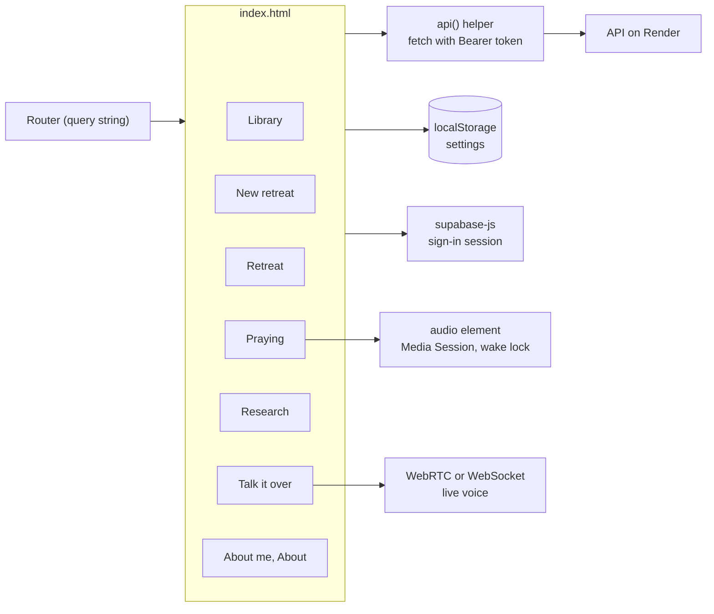

---

## 17. How it talks to the backend

| When | Call |
| --- | --- |
| Start-up | `GET /api/health`, `GET /api/options` (voices, models and prices, prompts, research services and their status, conversation providers, Supabase settings), `GET /api/me` |
| Library | `GET /api/retreats` → `{retreats, examples}` |
| Make my retreat | `POST /api/retreats` (multipart: file, model, series, start date, and every option as JSON) → 202, then poll `GET /api/retreats/{id}` |
| Praying | `POST /api/retreats/{id}/days/{n}/progress` as parts play; `.../prayed` with the word and note |
| Rewrite / re-record a day | `POST /api/retreats/{id}/days/{n}/build` |
| Try again after a failure | `POST /api/retreats/{id}/days/{n}/retry` (records only the failed parts) |
| Start date, title | `PATCH /api/retreats/{id}` |
| Printable script | `GET /api/retreats/{id}/script.pdf?day=n&order=lectio&pause=30` |
| Research page | `GET /api/retreats/{id}/research` |
| About me | `GET`/`PUT /api/profile`, `POST /api/profile/upload` |
| Talk it over | `POST /api/talk/session`, `POST /api/talk/end`, `GET`/`DELETE /api/talk/history` |

Every error comes back as `{"error": {"status", "message"}}` with a message written for people, which the page shows as-is. If the server can't be reached, the page explains that Render's free tier may be waking up (about a minute) and offers Retry.

---

## 18. Run it locally

```bash
# terminal 1: the API (see the API repo's README for keys; none are needed for a first run)
cd ignatius-hw4-api && .venv/bin/uvicorn app.main:app --reload --port 8000

# terminal 2: this page
cd ignatius-hw4-web && python3 -m http.server 5500
```

Open <http://localhost:5500>. `config.js` points at `localhost:8000` automatically. With no Supabase settings the API uses a single local user and local files, so there's nothing to sign in to.

Checking the layout: open Chrome's device toolbar at **390 × 844** (iPhone) and at 1280 wide; test dark mode with the rendering panel's `prefers-color-scheme`.

---

## 19. Deploying on GitHub Pages

Settings → Pages → Deploy from branch → `main`, `/ (root)`. Every push to `main` publishes in a minute or so. Bump the `?v=` number in `index.html` whenever a script in `js/`, `style.css` or `config.js` changes. Add the Pages URL to the API's `ALLOWED_ORIGINS` and to Supabase's Auth redirect URLs.

---

## 20. How it was built: a journal

The whole app was built in conversation with **Claude Code** (Claude Opus 5.5, with one design review by Claude Fable 5.1) over two days in September 2026, from a design made the day before. Every prompt is in [PROMPT_LOG.md](PROMPT_LOG.md). In outline:

### The method: spec-driven, in phases

This wasn't built by asking for features one at a time. Each big step started from a written spec, was built against it, and was then reviewed against it:

1. **Spec first.** Before any code: a [design spec](https://github.com/bcollier/ignatius-hw4-api/blob/main/docs/original-spec/design-spec.md), a [technical spec](https://github.com/bcollier/ignatius-hw4-api/blob/main/docs/original-spec/technical-spec.md), screen designs and a [build plan](https://github.com/bcollier/ignatius-hw4-api/blob/main/docs/original-spec/staging-plan.md) (September 24 to 25).
2. **Build to the spec.** The iPhone plan was scoped down to what the class project needed, a server and a web app anyone can use with their own material, and built against the spec's core: the lectio day, the reflection for the heart, the close reading, two voice tiers, a model that plans the days from a handout (September 25 to 26).
3. **A large spec-driven revision.** Claude Fable reviewed the working app, visually and in use, and wrote a redesign spec, [IMPROVEMENTS.md](https://github.com/bcollier/ignatius-hw4-api/blob/main/docs/IMPROVEMENTS.md). The app was then rebuilt to it: one step to make a retreat, the library, listening progress, the full-screen prayer screen, the journal, the installable app.
4. **A deep code cleanup.** A full readability audit on Clean Code principles: small functions that do one thing, names that say what they mean, no magic numbers, one place for one idea, comments that explain why, no dead code. The 730-line `main.py` became a thin app module plus one routes module per area; the 2,391-line `app.js` became thirteen scripts, one per view; the 155-line function that makes a day became an 11-line one running a small class whose steps read in order. All recorded in [CODE_CLEANUP.md](https://github.com/bcollier/ignatius-hw4-api/blob/main/docs/CODE_CLEANUP.md). Reviews since follow the [code review guidance](https://github.com/bcollier/ignatius-hw4-api/blob/main/docs/CODE_REVIEW.md), which turns those principles and the bugs found on iPhones into checklists.
5. **The prompts, rewritten from a brief.** Claude Fable wrote the planning, reflection, deep dive and companion prompts from a [brief](https://github.com/bcollier/ignatius-hw4-api/blob/main/docs/prompt-design/README.md) describing the whole app; they live as files in [app/prompt_texts](https://github.com/bcollier/ignatius-hw4-api/tree/main/app/prompt_texts).
6. **A visual redesign from a spec.** First a written direction, then seven mockups in Claude Design (Today at dawn and at night, praying, the silence, a prayed day gilded, a day as a two-page spread, the library), approved with one change ("books" became "retreats"), then built: the [visual redesign spec, with the mockups](https://github.com/bcollier/ignatius-hw4-api/blob/main/docs/VISUAL_REDESIGN.md), and the result in [section 12](#12-design-choices).
7. **Then testing on a real iPhone.** Each problem seen on the phone went back in as a prompt, was fixed and checked at iPhone size in Safari's engine, and was logged in [PROMPT_LOG.md](PROMPT_LOG.md), all 160-odd of them.

The journal below is the same story day by day.

**Wednesday night into Thursday, September 24 to 25: the original design.** The idea began with a real retreat: a 19th Annotation program (the Spiritual Exercises in daily life, September to May) that came as weekly handout PDFs. In a long session with Claude, the handouts first became daily documents with a close reading and a reflection "for listening", and a question about what it would cost to turn them into audio (Microsoft's free voices, a middle tier, and ElevenLabs and OpenAI's live voice at the high end). That grew into a plan for a native iPhone app, written up as four pieces:
- the [design spec](https://github.com/bcollier/ignatius-hw4-api/blob/main/docs/original-spec/design-spec.md): three sections a day (the Reading, A Word for You in Christ's voice, and The Text Up Close) in a lectio sequence, a pause to journal, three voices per tier, and a start date the user chooses;
- the voices and a virtual director: a live spoken companion, with its costs and safety;
- the [technical spec](https://github.com/bcollier/ignatius-hw4-api/blob/main/docs/original-spec/technical-spec.md): SwiftUI on iPhone and a Google Cloud pipeline (Cloud Run, Firestore, Workflows, Claude on Vertex AI);
- twenty screen designs in Claude Design (working name "Wellspring"), and the [build plan](https://github.com/bcollier/ignatius-hw4-api/blob/main/docs/original-spec/staging-plan.md): six to eight weeks to TestFlight with Claude Code and Codex working in parallel.

The planning repository's first commit was at 1:27 a.m. Eastern on Thursday, September 25; it was renamed **Ignatius at Home** at 4:54 p.m. that afternoon. The documents are copied in [docs/original-spec](https://github.com/bcollier/ignatius-hw4-api/tree/main/docs/original-spec).

**Thursday evening, September 25.**
- Pulled that iPhone design, read the HW4 assignment, and scoped a server-plus-web version: upload a PDF exercise, get three MP3s (reading, heart, deep dive).
- Decided to call Claude through **OpenRouter's Anthropic-compatible endpoint**, keeping Claude's web search and structured output while using OpenRouter credits.
- Talked through copyright, which led to the key design decision: *the user brings the material*. A handout with seven days becomes a seven-day retreat as written; seven loose verses and a painting become a composed seven-day retreat.
- Added free Microsoft voices beside ElevenLabs; chose MP3; editable prompts; images shown, not described; sign-in so a retreat made on a laptop plays on a phone; the bell-and-silence player; Supabase.

**Friday, September 26, morning.** Created the two repositories, set up Supabase (with simpler instructions for editing `.env` than vim), deployed the API with a Render Blueprint and the page on GitHub Pages. Fixed the first live bugs: image links doubled up with the API address, and a stale cached script.

**Friday afternoon: making it a retreat.**
- Spoken guidance: asking for the grace, silence, and a line before each of four readings, in the manner of the Examen; a voice per section; five-second gaps; total length.
- Model choice, with live prices and costs kept on a separate, tucked-away Costs page.
- The architecture document with diagrams of everything.
- **Free mode** on Jetstream (Muse Glimmer, Llama 4 Scout) so anyone can use it; open sign-in with anonymous guests; premium for an allowlist.
- Web research for free mode: Tavily, then Exa, Brave Search, Brave Answers, Firecrawl and Linkup, each wrapped to pause itself when out of credits; the printable PDF; a log table of every model call.
- Resuming jobs interrupted by a redeploy; series of retreats week by week; no limit on retreats.

**Friday evening: the redesign.** Claude Fable reviewed the app visually and in flow and wrote a redesign spec ([IMPROVEMENTS.md](https://github.com/bcollier/ignatius-hw4-api/blob/main/docs/IMPROVEMENTS.md)), which became: one step with Simple and Advanced tabs; the library with Continue; listening progress and missed days; the full-screen painting and docked player on phones; the journal after praying; the installable icon; the About page. Then, as requests came in: parts that know about each other; the background briefing for every model; About me; Talk it over with OpenAI and Grok, memory, and awareness of time and progress; costs only while making.

**Friday night: the demo.** The "Come and See" package; two example retreats (free, and Claude Fable with ElevenLabs); all research services combined; the research page; voice samples; these READMEs and screenshots; the full prompt log.

Throughout, Claude ran free builds on the Mac mini (Jetstream models, Microsoft voices, a local server, Chrome) to test real retreats end to end, not just unit tests, and kept 79 automated tests passing.

---

## 21. Lessons learned and bugs fixed

- **Cache everything, then bust it.** A phone kept an old `app.js` and the play button stopped working. Versioned asset URLs fixed it for good.
- **Absolute vs. relative URLs.** The page prefixed the API address onto Supabase's already-absolute signed links (`https://api...https//supabase...`). A tiny `fileUrl()` helper decides.
- **iOS stops timers when the phone locks.** Silences made with `setTimeout` would have hung; recorded silence in the same audio element keeps going.
- **Redeploys interrupt jobs.** Render's zero-downtime deploys can kill a job mid-plan ("Planning was interrupted by a server restart"). Jobs now save a heartbeat and resume from where they were.
- **Free services drop requests.** A real build lost two guidance clips; each piece is now retried with backoff.
- **Images must fit the model.** Extraction halved big images to 960 px; now they're scaled to fit 1,568 px, the size vision models read best.
- **Reasoning models need room.** Muse Glimmer returned empty replies when its token limit was small, because it spent them thinking; limits were raised for every step.
- **Titles repeat.** "Day 1 · Day 1: Follow Me" became "Day 1 · Follow Me."
- **Mermaid is picky.** Semicolons inside node labels break GitHub's renderer; every diagram is checked.
- **Words matter.** "Build audio" became "Make my retreat," and nothing is called spiritual direction, because the people who'd use this would rightly bristle at an AI claiming to be one.
- **Read the error, not the assumption.** The premium example's failed clips looked like running out of ElevenLabs credits; the real cause was the plan's limit on simultaneous requests. A two-request limit, retries, and a Try again that re-records only the failed clips fixed it without rewriting anything.
- **Show the work.** Once research used six services, it needed a place to see what was found: the research page.

---

## 22. Services: what runs it, free and paid

Everything a free account uses costs nothing to run; the premium pieces are paid and limited to an allowlist of accounts. Most pieces can be swapped for another provider with a setting, not a code change.

### Free services

| Service | What it is | What it does here | Why it's free |
| --- | --- | --- | --- |
| [GitHub Pages](https://pages.github.com) | Static web hosting from a GitHub repository | Serves this web app: the HTML, CSS, JavaScript, icons, paintings, the example and practice audio | Free for public repositories |
| [Render](https://render.com) | A cloud platform that builds and runs web services straight from a Git repository | Runs the Python server ([ignatius-hw4-api](https://github.com/bcollier/ignatius-hw4-api)): FastAPI and Uvicorn on Python 3.12, from a `render.yaml` Blueprint, redeployed automatically on every push, checked at `/api/health`. It extracts documents, runs the background jobs that plan, write and record retreats, and talks to every other service | The free web service. It sleeps after 15 minutes without visitors and takes up to a minute to wake (hence the waiting screen with its breathing circle and quotes), and its disk is temporary, so everything is kept in Supabase. A paid instance (about $7 a month) stays awake |
| [Supabase](https://supabase.com) | Hosted Postgres with sign-in and file storage | Sign-in (email links, guests, the Home Screen code), the `retreats` table, the `llm_calls` log of every model call, and a private bucket for the audio, paintings, research records and notes | The free plan |
| [Jetstream2](https://jetstream-cloud.org) | An NSF-funded academic cloud (Indiana University) with an OpenAI-compatible model API | Writes every free-mode retreat: Muse Glimmer (default, reads images) and Llama 4 Scout | An academic allocation: this is a class project. See below for other free options |
| Microsoft neural voices, through [edge-tts](https://github.com/rany2/edge-tts) | The voices of Microsoft Edge's Read Aloud, reached through an open-source Python package | Every free voice: Ava, Andrew, Christopher, Emma, Brian, Aria, Ryan and Sonia, with word timings for following the text | No key and no cost. It's unofficial; an app for the public should use [Azure AI Speech](https://learn.microsoft.com/en-us/azure/ai-services/speech-service/language-support), which has a free monthly allowance and then charges per character |
| [Brave Search](https://brave.com/search/api/), [Brave Answers](https://brave.com/search/api/), [Exa](https://exa.ai), [Tavily](https://tavily.com), [Firecrawl](https://www.firecrawl.dev), [Linkup](https://www.linkup.so) | Six web search services (see [section 9](#9-research-services)) | Research for every deep dive, all at once | Free monthly tiers; a service that runs out is paused until the next month |
| [bible-api.com](https://bible-api.com) | A free API for public-domain Bible text | The scripture for retreats made from an idea, in the [World English Bible](https://worldenglish.bible) | Free, no key |
| [Wikimedia Commons](https://commons.wikimedia.org) | The free media library behind Wikipedia | Public-domain paintings (the Examen's paintings) and open-licence Gregorian chant for the background music | Public domain and open licences, credited |
| Google Docs export | A shared Google Doc's download link | Reading a retreat's material, or About me, from a Google Doc link | Free for docs shared as "Anyone with the link" |
| [Google Fonts](https://fonts.google.com) | Free web fonts | Cormorant Garamond and EB Garamond | Free |

### Paid services (premium)

| Service | What it is | What it does here | What it costs |
| --- | --- | --- | --- |
| [OpenRouter](https://openrouter.ai) → [Claude](https://www.anthropic.com/claude) | One account and API for many models; the app uses its Anthropic-compatible endpoint | Premium planning and writing: **Claude Opus 5.5** by default, also Opus 5, Fable 5.1 (the premium example), Sonnet 5 and Haiku 4.5, with Claude's own web search on top of the free research | Per token: Opus 5.5 is $4 in and $20 out per million tokens, Fable 5.1 $10 and $50, and $0.01 a web search. A premium retreat usually costs a few dollars |
| [ElevenLabs](https://elevenlabs.io) | Expressive AI voices, and AI music | Premium voices (Sarah, George, Brian, Alice, Bill, Lily; [hear them](#7-voices-hear-them-and-compare)), and the quiet organ-and-strings background music (Music API) | A monthly plan with credits: here the $5 Starter plan plus $20 of extra credits, about 139,000 credits a month. A voice costs about half a credit per character; thirty minutes of narration is about $2 |
| [OpenAI GPT-Live-1](https://platform.openai.com) (Realtime API) | Real-time spoken conversation over WebRTC | Talk it over: the spoken prayer companion | Per minute of audio; free accounts get a few minutes a day |
| [xAI Grok voice](https://x.ai/api) | A second real-time voice model | An alternative voice for Talk it over | Per minute of audio |

### Swapping the free writing model

The free path speaks the standard OpenAI chat-completions format to whatever address `JETSTREAM_BASE_URL` points at (the settings are named after Jetstream2 because that came first). So another free model, your own model, or an OpenAI key is a change of three settings on Render, not of code:

| Instead of Jetstream2 | `JETSTREAM_BASE_URL` | `JETSTREAM_API_KEY` | `JETSTREAM_MODELS` (the first is the default) |
| --- | --- | --- | --- |
| **OpenRouter's free models** | `https://openrouter.ai/api/v1` | an OpenRouter key | For example, free at the time of writing: `nvidia/nemotron-3-ultra-550b-a55b:free`, `nvidia/nemotron-3-super-120b-a12b:free`, `google/gemma-4-31b-it:free`, `qwen/qwen3.8-27b:free`, `thinkingmachines/inkling:free`, or `openrouter/free` (OpenRouter picks one). Free models are rate-limited and the list changes; see [OpenRouter's free models](https://openrouter.ai/models?max_price=0) |
| **Your own model** with [Ollama](https://ollama.com) (or LM Studio, vLLM) | `http://your-machine:11434/v1` | anything (Ollama doesn't check it) | whatever you've pulled, for example `gemma4`, `qwen3`, `llama4` |
| **An OpenAI key** | `https://api.openai.com/v1` | your OpenAI key (the one Talk it over already uses works) | any OpenAI chat model your key can use |
| Claude directly, instead of through OpenRouter | (premium path) | set `ANTHROPIC_API_KEY` and `LLM_MODE=anthropic` | the same Claude models |

A model that can't read images still works: planning falls back to the text alone. Models on this path get the JSON format in the prompt rather than as a schema, so larger models plan more reliably.

---

## 23. Resources, credits and links

**On the tradition**
- [What are the Spiritual Exercises?](https://www.ignatianspirituality.com/ignatian-prayer/the-spiritual-exercises/what-are-the-spiritual-exercises/) and [Ignatian contemplation](https://www.ignatianspirituality.com/ignatian-prayer/ignatian-contemplation/), IgnatianSpirituality.com (Loyola Press)
- [The rules for discernment](https://www.ignatianspirituality.com/making-good-decisions/discernment-of-spirits/rules-for-discernment/) and [the Examen](https://www.ignatianspirituality.com/ignatian-prayer/the-examen/), IgnatianSpirituality.com
- [The text of the Spiritual Exercises](https://www.ccel.org/ccel/ignatius/exercises.html), Christian Classics Ethereal Library
- [An Ignatian Prayer Adventure](https://www.ignatianspirituality.com/ignatian-prayer/the-spiritual-exercises/an-ignatian-prayer-adventure/), a free online retreat; [Praying Every Day](https://onlineministries.creighton.edu/CollaborativeMinistry/cmo-retreat.html), Creighton University
- [*Verbum Domini*](https://www.vatican.va/content/benedict-xvi/en/apost_exhortations/documents/hf_ben-xvi_exh_20100930_verbum-domini.html), paragraphs 86–87; [Lectio divina](https://www.saintjohnsabbey.org/lectio-divina), Saint John's Abbey; [Guigo II](https://en.wikipedia.org/wiki/Guigo_II)

**Content**
- Scripture: [World English Bible](https://worldenglish.bible), public domain, via [bible-api.com](https://bible-api.com)
- Paintings: public domain or CC0, via [Wikimedia Commons](https://commons.wikimedia.org) (credits in section 5)
- Bell and silences: synthesized by `tools/make_sounds.py`; icons drawn by `tools/make_icons.py`

**Services**
- Hosting: [GitHub Pages](https://pages.github.com), [Render](https://render.com); data and sign-in: [Supabase](https://supabase.com)
- Models: [OpenRouter](https://openrouter.ai) (Claude), [Jetstream2](https://jetstream-cloud.org) (Muse Glimmer, Llama 4 Scout)
- Voices: [edge-tts](https://github.com/rany2/edge-tts) (Microsoft), [ElevenLabs](https://elevenlabs.io); conversation: [OpenAI](https://platform.openai.com), [xAI](https://x.ai)
- Research: [Brave Search API](https://brave.com/search/api/), [Exa](https://exa.ai), [Tavily](https://tavily.com), [Firecrawl](https://firecrawl.dev), [Linkup](https://linkup.so)

**Built with** [Claude Code](https://claude.com/claude-code). Every prompt: [PROMPT_LOG.md](PROMPT_LOG.md). Architecture: [ARCHITECTURE.md](https://github.com/bcollier/ignatius-hw4-api/blob/main/docs/ARCHITECTURE.md). Code organization and readability: [CODE_CLEANUP.md](https://github.com/bcollier/ignatius-hw4-api/blob/main/docs/CODE_CLEANUP.md).

*The reflections, deep dives and guidance are written by AI models from your material, and the voices are synthetic. Treat them as a companion to your own prayer and, if you have one, your spiritual director, not a replacement.*
